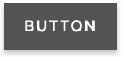

# Buttons

## Overview

Buttons are vital for creating a smooth conversational flow on the web, and should be used sparingly. Buttons should adhere to standard web practices, and afford for a target area of 45 pixels. They should also appear slightly raised, and not be completely flat. They have a slight shadow on them so they appear clickable. The small buttons are often used on forms and to set filters on listing pages. The large buttons should be used for primary calls to action. Font sizes reduce slightly on mobile.

### Button Variations

| **Visual** | **Name** | **Description & Usage** |
| --- | --- | --- | --- | --- | --- | --- | --- | --- |
|  | [Primary Button](buttons.md#primary-button) | For the principle call to action on the page. |
|  | [Secondary Button](buttons.md#secondary-button) | For the secondary action on a page. |
|  | [Quaternary Button](buttons.md#quaternary-button) | For the fourth action on a page. |
|   | [Small Button](buttons.md#small-primary-button) | Use when there is not enough space for a regular button size.  |
|   | [Outline Button](buttons.md#outline-primary-button) | A subtle alternative to the default button styling, appropriate for certain backdrops and for displaying active state \(e.g. previous and next\) |
|   | [Link Button](buttons.md#link-button) | Link buttons are used to navigate to another page  |
|  | [Icon Button](buttons.md#icon-button) | When words are not enough, icons can be used in buttons to better communicate what the button does. Icons are always paired with text. |
|    | [Search Button](buttons.md#search-button) | The search button is included in the search bar, It is a submit button for the form to reduce the number of keystrokes required to use the form. The magnifying glass is universally recognized by users as an indicator of search, and doesn’t need to be visually paired with the word "Search" as long as it remains for screen readers. |

### Accessibility & Best Practices

## Code


### Primary Button







```markup
<button type="button" class="ma__button" aria-label="">
  Button
</button>
```



[Primary Button in Storybook](http://mayflower-react.digital.mass.gov/?knob-button.info=this%20will%20be%20the%20tooltip%20text%20on%20hover&knob-button.text=button&knob-button.href=&selectedKind=atoms%2Fbuttons&selectedStory=Button&full=0&addons=1&stories=1&panelRight=0&addonPanel=storybook%2Factions%2Factions-panel)



[Primary Button in Pattern Lab](https://mayflower.digital.mass.gov/?p=atoms-button)​



#### Small Primary Button



```markup
<button type="button" class="ma__button ma__button--small" aria-label="">
  Button
</button>
```



[Small Primary Button in Storybook](https://mayflower-react.digital.mass.gov/?knob-button.size=small&knob-button.info=this%20will%20be%20the%20tooltip%20text%20on%20hover&knob-button.text=button&knob-button.href=&selectedKind=atoms%2Fbuttons&selectedStory=Button&full=0&addons=1&stories=1&panelRight=0&addonPanel=storybooks%2Fstorybook-addon-knobs)



[Small Primary Button in Pattern Lab](https://mayflower.digital.mass.gov/?p=atoms-button-as-small)



#### Outline Primary Button








```markup
<button type="button" class="ma__button ma__button--minor" aria-label="">
  Button
</button>
```



[Outline Button in Storybook](https://mayflower-react.digital.mass.gov/?knob-button.href=https%3A%2F%2Fmass.gov&knob-button.text=button&knob-button.info=this%20will%20be%20the%20tooltip%20text%20on%20hover&knob-ButtonWithIcon.text=BUTTON&knob-button.outline=true&knob-ButtonWithIcon.icon=chevron&selectedKind=atoms%2Fbuttons&selectedStory=Button&full=0&addons=1&stories=1&panelRight=0&addonPanel=storybooks%2Fstorybook-addon-knobs)



[Outline Button in Pattern Lab](https://mayflower.digital.mass.gov/?p=atoms-button-as-outline)



### Secondary Button







```markup
<button type="button" class="ma__button ma__button--small ma__button--secondary ma__button--minor" aria-label="">
  Button
</button>
```



[Secondary Button in Storybook](http://mayflower-react.digital.mass.gov/?knob-button.theme=secondary&knob-button.info=this%20will%20be%20the%20tooltip%20text%20on%20hover&knob-button.text=button&knob-button.href=&knob-button.outline=true&selectedKind=atoms%2Fbuttons&selectedStory=Button&full=0&addons=1&stories=1&panelRight=0&addonPanel=storybooks%2Fstorybook-addon-knobs)



[Secondary Button in Pattern Lab](https://mayflower.digital.mass.gov/?p=atoms-button-as-secondary-color)



### Quaternary Button







```markup
<button type="button" class="ma__button ma__button--quaternary" aria-label="">
  Button
</button>
```



[Quaternary Button in Storybook](http://mayflower-react.digital.mass.gov/?knob-button.theme=quaternary&knob-button.info=this%20will%20be%20the%20tooltip%20text%20on%20hover&knob-button.text=button&knob-button.href=&selectedKind=atoms%2Fbuttons&selectedStory=Button&full=0&addons=1&stories=1&panelRight=0&addonPanel=storybooks%2Fstorybook-addon-knobs)



[Quaternary Button in Pattern Lab](https://mayflower.digital.mass.gov/?p=atoms-button-as-quaternary-color)



### Link Button







```markup
<a href="#" class="ma__button" title="">
  Button
</a>
```



[Link Button in Storybook](https://mayflower-react.digital.mass.gov/?knob-button.href=https%3A%2F%2Fmass.gov&knob-button.text=button&knob-button.info=this%20will%20be%20the%20tooltip%20text%20on%20hover&knob-ButtonWithIcon.text=BUTTON&knob-ButtonWithIcon.icon=chevron&selectedKind=atoms%2Fbuttons&selectedStory=Button&full=0&addons=1&stories=1&panelRight=0&addonPanel=storybooks%2Fstorybook-addon-knobs)



[Link Button in Pattern Lab](https://mayflower.digital.mass.gov/?p=atoms-button-as-link)



### Icon Button







```markup
<button class="ma__button-icon ma__icon">
  <span>BUTTON</span>
  <svg aria-hidden="true" width="20" height="20" viewBox="0 0 59 38" xmlns="http://www.w3.org/2000/svg"><path d="M29.414,37.657 L0.344,8.586 L8.828,0.102 L29.414,20.686 L50,0.1 L58.484,8.585 L29.414,37.657"></path></svg>
</button>
```



[Icon Button in Storybook](https://mayflower-react.digital.mass.gov/?knob-ButtonWithIcon.canExpand=true&knob-button.href=&knob-button.text=button&knob-ButtonWithIcon.capitalized=true&knob-button.info=this%20will%20be%20the%20tooltip%20text%20on%20hover&knob-ButtonWithIcon.text=BUTTON&knob-ButtonWithIcon.icon=chevron&knob-ButtonWithIcon.expanded=true&selectedKind=atoms%2Fbuttons&selectedStory=ButtonWithIcon&full=0&addons=1&stories=1&panelRight=0&addonPanel=storybooks%2Fstorybook-addon-knobs)



Not Available



#### Search Button



```markup
<button type="submit" class="ma__button-search">
  <span>Search</span>
  <svg aria-hidden="true"><use xlink:href="#bfc92151769435abdd9eb852cabede0f.0"></use></svg><svg xmlns="http://www.w3.org/2000/svg" style="display: none"><symbol xmlns="http://www.w3.org/2000/svg" aria-hidden="true" version="1.1" viewBox="0 0 20 20" id="bfc92151769435abdd9eb852cabede0f.0"><path d="M1424.99 107.4L1419.66 102.105C1420.44 100.884 1420.89 99.4383 1420.89 97.8892C1420.89 93.54 1417.3300000000002 90 1412.95 90C1408.57 90 1405.01 93.54 1405.01 97.89C1405.01 102.241 1408.57 105.781 1412.95 105.781C1414.43 105.781 1415.82 105.375 1417.01 104.67L1422.3799999999999 110ZM1407.97 97.89C1407.97 95.1625 1410.2 92.9416 1412.95 92.9416C1415.7 92.9416 1417.93 95.1617 1417.93 97.89C1417.93 100.619 1415.7 102.839 1412.95 102.839C1410.2 102.839 1407.97 100.619 1407.97 97.89Z " transform="matrix(1,0,0,1,-1405,-90)"/></symbol></svg>
</button>
```



[Search Button In Storybook](https://mayflower-react.digital.mass.gov/?knob-ButtonSearch.text=Search&knob-ButtonSearch.ariaLabel=Search&knob-button.href=https%3A%2F%2Fmass.gov&knob-button.text=button&knob-button.info=this%20will%20be%20the%20tooltip%20text%20on%20hover&knob-ButtonWithIcon.text=BUTTON&knob-button.outline=true&knob-ButtonWithIcon.icon=chevron&selectedKind=atoms%2Fbuttons&selectedStory=ButtonSearch&full=0&addons=1&stories=1&panelRight=0&addonPanel=storybooks%2Fstorybook-addon-knobs)



[Search Button in Pattern Lab](https://mayflower.digital.mass.gov/?p=atoms-button-search)



## Style

### Classnames

| **Name** | **scss Modifier** |
| --- | --- | --- | --- | --- | --- | --- | --- |
| Primary Button | .ma\_\_button |
| Small Button | .ma\_\_button--small |
| Outline Button | .ma\_\_button--minor |
| Secondary Button | .ma\_\_button--secondary |
| Quaternary Button | .ma\_\_button--quaternary |
| Icon Button | .ma\_\_button--icon |
| Search Button | .ma\_\_button--search |

