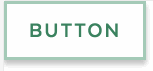

# Buttons

## Overview

Buttons are vital for creating a smooth conversational flow on the web, and should be used sparingly. Buttons should adhere to standard web practices, and afford for a target area of 45 pixels. They should also appear slightly raised, and not be completely flat. They have a slight shadow on them so they appear clickable. The small buttons are often used on forms and to set filters on listing pages. The large buttons should be used for primary calls to action. Font sizes reduce slightly on mobile.

### Anatomy

Accessibility

Label

## 

## Button Variations

### Primary Button

For the principle call to action on the page.




```text
<button type="button" class="ma__button" aria-label="">Button</button>
```



[Primary Button in Storybook](http://mayflower-react.digital.mass.gov/?knob-button.info=this%20will%20be%20the%20tooltip%20text%20on%20hover&knob-button.text=button&knob-button.href=&selectedKind=atoms%2Fbuttons&selectedStory=Button&full=0&addons=1&stories=1&panelRight=0&addonPanel=storybook%2Factions%2Factions-panel)



[Primary Button in Pattern Lab](https://mayflower.digital.mass.gov/?p=atoms-button)​



#### Small Primary Button

Use when there is not enough space for a regular button size. 



```text
<button type="button" class="ma__button ma__button--small  " aria-label="">Button</button>
```



[Small Primary Button in Storybook](https://mayflower-react.digital.mass.gov/?knob-button.size=small&knob-button.info=this%20will%20be%20the%20tooltip%20text%20on%20hover&knob-button.text=button&knob-button.href=&selectedKind=atoms%2Fbuttons&selectedStory=Button&full=0&addons=1&stories=1&panelRight=0&addonPanel=storybooks%2Fstorybook-addon-knobs)



[Small Primary Button in Pattern Lab](https://mayflower.digital.mass.gov/?p=atoms-button-as-small)



### Secondary Button

For the secondary action on a page.





```text
<button type="button" class="ma__button ma__button--small ma__button--secondary ma__button--minor" aria-label="">Button</button>
```



[Secondary Button in Storybook](http://mayflower-react.digital.mass.gov/?knob-button.theme=secondary&knob-button.info=this%20will%20be%20the%20tooltip%20text%20on%20hover&knob-button.text=button&knob-button.href=&knob-button.outline=true&selectedKind=atoms%2Fbuttons&selectedStory=Button&full=0&addons=1&stories=1&panelRight=0&addonPanel=storybooks%2Fstorybook-addon-knobs)



[Secondary Button in Pattern Lab](https://mayflower.digital.mass.gov/?p=atoms-button-as-secondary-color)



#### Small Secondary Button



```text
<button type="button" class="ma__button ma__button--small ma__button--secondary" aria-label="">Button</button>
```



[Small Secondary Button in Storybook](https://mayflower-react.digital.mass.gov/?knob-button.size=small&knob-button.info=this%20will%20be%20the%20tooltip%20text%20on%20hover&knob-button.text=button&knob-button.href=&knob-button.theme=secondary&selectedKind=atoms%2Fbuttons&selectedStory=Button&full=0&addons=1&stories=1&panelRight=0&addonPanel=storybooks%2Fstorybook-addon-knobs)







### Quaternary Button

For the fourth action on a page.




```text
<button type="button" class="ma__button  ma__button--quaternary " aria-label="">Button</button>
```



[Quaternary Button in Storybook](http://mayflower-react.digital.mass.gov/?knob-button.theme=quaternary&knob-button.info=this%20will%20be%20the%20tooltip%20text%20on%20hover&knob-button.text=button&knob-button.href=&selectedKind=atoms%2Fbuttons&selectedStory=Button&full=0&addons=1&stories=1&panelRight=0&addonPanel=storybooks%2Fstorybook-addon-knobs)



[Quaternary Button in Pattern Lab](https://mayflower.digital.mass.gov/?p=atoms-button-as-quaternary-color)



### Button with Icon

When words are not enough, icons can be used in buttons to better communicate what the button does. Icons are always paired with text.

