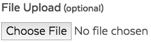

# File Uploader

## Overview

`<input>` elements with `type="file"` let the user choose one or more files from their device storage. Once chosen, the files can be uploaded to a server using form submission, or manipulated using JavaScript and the File API.

Regardless of the user's device or operating system, the file input provides a button that opens up a file picker dialog that allows the user to choose a file.

## Usage



### Allow multiple files

Including the `multiple` attribute, specifies that multiple files can be chosen at once. The user can choose multiple files from the file picker in any way that their chosen platform allows. 

If the user should choose a single file per `<input>`, omit the `multiple` attribute.

### Specify accepted file types

`accept` attribute takes a comma-separated list of allowed file extensions or MIME types. For example:

| **Allowed file extentios/MINE types** | **Sample patterns** |
| :--- | :--- |
| PNG | `image/png` `.png` |
| PNG or JPG | `image/png, image/jpeg` `.png, .jpg, .jpeg` |
| Any file with an image | `image/*` |
| Any file with an audio | `audio/*` |
| Any file with a video | `video/*` |
| Anything like an MS Word document | `.doc,.docx,.xml,application/msword,application/vnd.openxmlformats-officedocument.wordprocessingml.document` |

The `accept` attribute doesn't validate the types of the selected files; it simply provides hints for browsers to guide users towards selecting the correct file types. It is still possible (in most cases) for users to toggle an option in the file chooser that makes it possible to override this and select any file they wish, and then choose incorrect file types.

Because of this, you should make sure that the accept attribute is backed up by appropriate server-side validation.

### Accessibility & Best Practices

The label and the text field have to be paired to identify the text field.

`<label>` requires `for` attribute to establish the association with the text field and describe the field. So, users can understand what this text field is for.

The `for` attribute share the same value with its paired `<input>`'s `id` to establish their association.

`id` is required to `<input type="file">`. Ensure its value is unique in the page.

Assistive technologies use this association to identify the field to the user.

## Code



```text
<label 
  for="optional-input"
  class="ma__label ma__label--optional ">File Upload</label>
<input 
  class="ma__input " 
  name="optional-input" 
  id="optional-input" 
  type="file" 
  data-type="binary"
         />
```



Work in progress







## Style

### Classnames

| **Name** | **Class Modifier** |
| :--- | :--- |
| Label for optional field | `.ma__label` `.ma__label--optional` |
| Label for required field | `.ma__label` `.ma__label--required` |
| Input | `.ma__input` |
