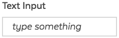
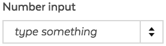
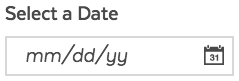

# Input

## Overview

Input fields allow the user to enter any combination of letters, numbers, or symbols of their choosing \(unless otherwise restricted\).

`<input>` elements are used within a `<form>` element to declare input controls allow users enter data.

An input field can be specified what data type to accept with its type attribute.

## Usage

### Variations with different data types

| **Visual** | **Input Type** | **Description & Usage** |
| :--- | :--- | :--- |
|  | Text | Text input allows the user to enter any combination of letters, numbers, or symbols of their choosing \(unless otherwise restricted\). |
|  | Number | Number input is used to let the user enter a number. It includes built-in validation to reject non-numerical entries. Browsers that don't support type "number" fall back to using a standard "text" input. |
| ADD SCREENSHOT | Telephone | Telephone input to let the user enter a telephone number. Unlike `<input type="email">` and `<input type="url">` , the input value is not automatically validated to a particular format before the form can be submitted, because formats for telephone numbers vary so much around the world.  Browsers that don't support type "email" fall back to being a standard "text" input. |
| ADD SCREENSHOT | Email | Email input lets the user to enter and edit an email address. The input value is automatically validated to ensure that it's either empty or a properly-formatted email address before the form can be submitted. Browsers that don't support type "email" fall back to being a standard "text" input. |
| ADD SCREENSHOT | URL | URL input lets the user enter a URL. The input value is automatically validated to ensure that it's either empty or a properly-formatted URL before the form can be submitted. Browsers that don't support type "email" fall back to being a standard "text" input. |
| ADD SCREENSHOT | Password | Password input provides a way for the user to securely enter a password. Entered text is obscured so that it cannot be read, usually by replacing each character with a symbol such as the asterisk \("\*"\) or a dot \("•"\). This character will vary depending on the user agent and OS. |
|  | Date | Date input lets the user enter a date, either using a text box that automatically validates the content, or using a special date picker interface. The resulting value includes the year, month, and day, but not the time. In unsupported browsers, the control degrades gracefully a standard "text" input. |

### Other input types:

* File Upload

### Accessibility & Best Practices

The label and the text field have to be paired to identify the text field.

`<label>` requires `for` attribute to establish the association with the text field and describe the field. So, users can understand what this text field is for.

The `for` attribute share the same value with its paired `<input>`'s `id` to establish their association.

`id` is required to `<input>` for the paring. Ensure its value is unique in the page.

Assistive technologies use this association to identify the field to the user.

## Code

### Text



```text
<label 
  for="optional-input"
  class="ma__label ma__label--optional ">Text Input</label>
<input 
  class="ma__input " 
  name="optional-input" 
  id="optional-input" 
  type="text" 
  placeholder="Optional input" 
  data-type="text"
         />
```



```text

  <label 
  for="{{ inputText.id }}"
  class="ma__label {{ inputText.required ? 'ma__label--required' : 'ma__label--optional'}} {{ inputText.hiddenLabel ? 'ma__label--hidden' : '' }}">{{inputText.labelText}}</label>


  <div class="ma__error-msg">{{ inputText.errorMsg }}</div>

<input 
  class="ma__input {{ inputText.required ? 'js-is-required' : ''}}" 
  name="{{ inputText.name }}" 
  id="{{ inputText.id }}" 
  type="{{ inputText.type }}" 
  placeholder="{{ inputText.placeholder }}" 
  data-type="{{ inputText.type }}"
  
    maxlength="{{ inputText.maxlength }}"
  
  
    pattern="{{ inputText.pattern }}*"
  
  
    style="width: {{ inputText.width }}px" 
  
  {{ inputText.required ? 'required' : '' }} />
```



### Number



```text
<label 
  for="number-input"
  class="ma__label ma__label--required ">Number input</label>
<input 
  class="ma__input js-is-required" 
  name="number-input" 
  id="number-input" 
  type="number" 
  placeholder="type something" 
  data-type="number"
      maxlength="16"
        pattern="[0-9]*"
      required />
```



```text

  <label 
  for="{{ inputText.id }}"
  class="ma__label {{ inputText.required ? 'ma__label--required' : 'ma__label--optional'}} {{ inputText.hiddenLabel ? 'ma__label--hidden' : '' }}">{{inputText.labelText}}</label>


  <div class="ma__error-msg">{{ inputText.errorMsg }}</div>

<input 
  class="ma__input {{ inputText.required ? 'js-is-required' : ''}}" 
  name="{{ inputText.name }}" 
  id="{{ inputText.id }}" 
  type="{{ inputText.type }}" 
  placeholder="{{ inputText.placeholder }}" 
  data-type="{{ inputText.type }}"
  
    maxlength="{{ inputText.maxlength }}"
  
  
    pattern="{{ inputText.pattern }}*"
  
  
    style="width: {{ inputText.width }}px" 
  
  {{ inputText.required ? 'required' : '' }} />
```



Mobile browsers further help with the user experience by showing a special keyboard more suited for entering numbers when the user tries to enter a value.

A number input is considered valid when empty and when a single number is entered, but is otherwise invalid. If the required attribute is used, the input is no longer considered valid when empty.

#### Controlling step size

By default, the up and down buttons provided for you to step the number up and down will step the value up and down by 1. You can change this by providing a `step` attribute, which takes as its value a number specifying the step amount.

**Allowing decimal values**

When a number with a decimal, such as "1.0", is entered to the field, it will be considered invalid. If the field requires a value with decimals, set the `step` value \(e.g. `step="0.01"` to allow decimals to two decimal places\).

#### Specifying minimum and maximum values

You can use the `min` and `max` attributes to specify a minimum and maximum value that the field can have.

### Telephone



```text
<label 
  for="optional-input"
  class="ma__label ma__label--optional ">Telephone Input</label>
<input 
  class="ma__input " 
  name="optional-input" 
  id="optional-input" 
  type="tel" 
  placeholder="Optional input" 
  data-type="text"
         />
```



### Email



```text
<label 
  for="optional-input"
  class="ma__label ma__label--optional ">Text Input</label>
<input 
  class="ma__input " 
  name="optional-input" 
  id="optional-input" 
  type="email" 
  placeholder="Optional input" 
  data-type="text"
         />
```



### URL



```text
<label 
  for="optional-input"
  class="ma__label ma__label--optional ">URL Input</label>
<input 
  class="ma__input " 
  name="optional-input" 
  id="optional-input" 
  type="url" 
  placeholder="Optional input" 
  data-type="text"
         />
```



### Password

### Date



```text
<label for="date-input">Select a Date</label>
<input 
  class="ma__input-date js-input-date " 
  name="date-input" 
  id="date-input" 
  type="date" 
  placeholder="mm/dd/yy" 
  data-type="date"
  data-restrict="max" 
   />
```



```text
<label for="{{ inputDate.id }}">{{inputDate.labelText}}</label>
<input 
  class="ma__input-date js-input-date {{ inputDate.required ? 'js-is-required' : ''}}" 
  name="{{ inputDate.name }}" 
  id="{{ inputDate.id }}" 
  type="date" 
  placeholder="{{ inputDate.placeholder }}" 
  data-type="date"
  data-restrict="{{ inputDate.restrict }}" 
  {{ inputDate.required ? 'required' : '' }} />
```



Non-supporting browsers gracefully degrade to a text input, but this creates problems both in terms of consistency of user interface \(the presented control will be different\), and data handling.

With a date input, the actual value is always normalized to the format `yyyy-mm-dd`. With a text input \(in non-supporting browsers\) on the other hand, by default the browser has no recognition of what format the date should be in, and there are lots of different ways in which people write dates, for example:

* `ddmmyyyy`
* `dd/mm/yyyy`
* `mm/dd/yyyy`
* `dd-mm-yyyy`
* `mm-dd-yyyy`
* `Month dd yyyy`

Workaround is to put a `pattern` attribute on the date input for example: `pattern="[0-9]{4}-[0-9]{2}-[0-9]{2}"` Even though the date input doesn't use it, the text input fallback will. `placeholder` can be also used to diplay the format: `yyyy-mm-dd`

## Style

### Classnames

| **Name** | **Class Modifier** |
| :--- | :--- |
| Label for optional field | `.ma__label` `.ma__label--optional` |
| Label for required field | `.ma__label` `.ma__label--required` |
| Input | `.ma__input` |

