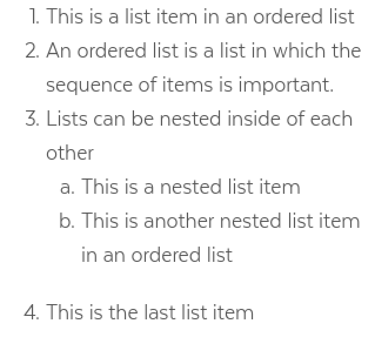
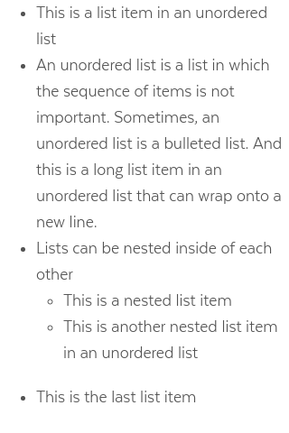

# Lists

## Overview

Lists display a series of related content. Each list item begins with a bullet or a number.

### List Types

| **Visual** | **Name** | Description & Usage |
| --- | --- | --- |
|   | [Ordered List](lists.md#ordered-list) | Use ordered lists to group a set of items in a prioritized or step by step sequence.. |
|   | [Unordered List](lists.md#unordered-list) | Use unordered lists to group shortened content of the same status or value. |

### Accessibility & Best Practices

## Code

### Ordered List



```markup
<ol>
  <li>This is a list item in an ordered list
  <li>An ordered list is a list in which the sequence of items is important. Top level item counters are digits
  <li>
    Lists can be nested inside of each other
    <ol>
      <li>This is a nested list item. After digits list items counters are lower-alpha.
      </li>
      <li>
        This is another nested list item in an ordered list
        <ol>
          <li>
            This is a nested list item. After lower-alpha counters, lower-roman counters are used.
            <ol>
              <li>This is a nested list item. After lower-roman counters, the counters loop back to digits.</li>
              <li>This is another nested list item in an ordered list</li>
            </ol>
          </li>
          <li>This is another nested list item in an ordered list
          </li>
        </ol>
      </li>
    </ol>
  </li>
  <li>This is the last list item
</ol>
```



[Ordered List in React](https://mayflower-react.digital.mass.gov/?knob-href=%23&knob-coloredHeading.text=Title%20text&knob-text=Title%20text&knob-info=&knob-compHeading.title=Title%20text&knob-sidebarHeading.title=Key%20Agencies&knob-pagination.pages=%5B%7B%22active%22%3Afalse%2C%22text%22%3A%221%22%2C%22ariaLabel%22%3A%22Go%20to%20Search%20Results%20Page%201%22%7D%2C%7B%22active%22%3Atrue%2C%22text%22%3A%22spacer%22%7D%2C%7B%22active%22%3Afalse%2C%22text%22%3A%223%22%2C%22ariaLabel%22%3A%22Go%20to%20Search%20Results%20Page%203%22%7D%2C%7B%22active%22%3Atrue%2C%22text%22%3A%224%22%2C%22ariaLabel%22%3A%22Go%20to%20Search%20Results%20Page%204%22%7D%2C%7B%22active%22%3Afalse%2C%22text%22%3A%225%22%2C%22ariaLabel%22%3A%22Go%20to%20Search%20Results%20Page%205%22%7D%2C%7B%22active%22%3Afalse%2C%22text%22%3A%22spacer%22%7D%2C%7B%22active%22%3Afalse%2C%22text%22%3A%2210%22%2C%22ariaLabel%22%3A%22Go%20to%20Search%20Results%20Page%2010%22%7D%5D&knob-compHeading.titleContext=&knob-ButtonSearch.text=Search&knob-pagination.next.text=Next&knob-pagination.prev.text=Previous&knob-HeaderSearch.defaultText=&knob-coloredHeading.color=&knob-compHeading.id=&knob-HeaderSearch.withOrgDropdown=true&knob-level=1&knob-pagination.prev.ariaLabel=Go%20to%20Previous%20Search%20Results%20Page&knob-pagination.next.ariaLabel=Go%20to%20Next%20Search%20Results%20Page&knob-coloredHeading.level=2&knob-List%20Item%200=This%20is%20a%20list%20item%20in%20an%20ordered%20list&knob-ButtonSearch.ariaLabel=Search&knob-tableOptions.feeTable=%7B%22head%22%3A%7B%22rows%22%3A%5B%7B%22rowSpanOffset%22%3Afalse%2C%22cells%22%3A%5B%7B%22heading%22%3Afalse%2C%22colspan%22%3A%22%22%2C%22rowspan%22%3A%22%22%2C%22text%22%3A%22Type%22%7D%2C%7B%22heading%22%3Atrue%2C%22colspan%22%3A%22%22%2C%22rowspan%22%3A%22%22%2C%22text%22%3A%22Name%22%7D%2C%7B%22heading%22%3Atrue%2C%22colspan%22%3A%22%22%2C%22rowspan%22%3A%22%22%2C%22text%22%3A%22Fee%22%7D%5D%7D%5D%7D%2C%22bodies%22%3A%5B%7B%22rows%22%3A%5B%7B%22rowSpanOffset%22%3Afalse%2C%22cells%22%3A%5B%7B%22heading%22%3Atrue%2C%22colspan%22%3A%22%22%2C%22rowspan%22%3A%224%22%2C%22text%22%3A%22Freshwater%20Fishing%22%7D%2C%7B%22heading%22%3Afalse%2C%22colspan%22%3A%22%22%2C%22rowspan%22%3A%22%22%2C%22text%22%3A%22Resident%20Citizen%20or%20Non-Resident%20Fishing%22%7D%2C%7B%22heading%22%3Afalse%2C%22colspan%22%3A%22%22%2C%22rowspan%22%3A%22%22%2C%22text%22%3A%22%2427.50%22%7D%5D%7D%2C%7B%22rowSpanOffset%22%3Atrue%2C%22cells%22%3A%5B%7B%22heading%22%3Afalse%2C%22colspan%22%3A%22%22%2C%22rowspan%22%3A%22%22%2C%22text%22%3A%22Resident%20Citizen%20or%20Non-Resident%20Minor%20Fishing%20%28Age%2015-17%29%22%7D%2C%7B%22heading%22%3Afalse%2C%22colspan%22%3A%22%22%2C%22rowspan%22%3A%22%22%2C%22text%22%3A%22FREE%22%7D%5D%7D%2C%7B%22rowSpanOffset%22%3Atrue%2C%22cells%22%3A%5B%7B%22heading%22%3Afalse%2C%22colspan%22%3A%22%22%2C%22rowspan%22%3A%22%22%2C%22text%22%3A%22Resident%20Citizen%20Fishing%20%28Age%2065-69%29%22%7D%2C%7B%22heading%22%3Afalse%2C%22colspan%22%3A%22%22%2C%22rowspan%22%3A%22%22%2C%22text%22%3A%22%2416.25%22%7D%5D%7D%2C%7B%22rowSpanOffset%22%3Atrue%2C%22cells%22%3A%5B%7B%22heading%22%3Afalse%2C%22colspan%22%3A%22%22%2C%22rowspan%22%3A%22%22%2C%22text%22%3A%22Resident%20Citizen%20Fishing%20%28Aged%2070%20or%20Over%29%22%7D%2C%7B%22heading%22%3Afalse%2C%22colspan%22%3A%22%22%2C%22rowspan%22%3A%22%22%2C%22text%22%3A%22FREE%22%7D%5D%7D%5D%7D%2C%7B%22rows%22%3A%5B%7B%22rowSpanOffset%22%3Afalse%2C%22cells%22%3A%5B%7B%22heading%22%3Atrue%2C%22colspan%22%3A%22%22%2C%22rowspan%22%3A%224%22%2C%22text%22%3A%22Hunting%22%7D%2C%7B%22heading%22%3Afalse%2C%22colspan%22%3A%22%22%2C%22rowspan%22%3A%22%22%2C%22text%22%3A%22Resident%20Citizen%20Hunting%22%7D%2C%7B%22heading%22%3Afalse%2C%22colspan%22%3A%22%22%2C%22rowspan%22%3A%22%22%2C%22text%22%3A%22%2427.50%22%7D%5D%7D%2C%7B%22rowSpanOffset%22%3Atrue%2C%22cells%22%3A%5B%7B%22heading%22%3Afalse%2C%22colspan%22%3A%22%22%2C%22rowspan%22%3A%22%22%2C%22text%22%3A%22Resident%20Citizen%20Hunting%2C%20%28Age%2065-69%29%22%7D%2C%7B%22heading%22%3Afalse%2C%22colspan%22%3A%22%22%2C%22rowspan%22%3A%22%22%2C%22text%22%3A%22%2416.25%22%7D%5D%7D%2C%7B%22rowSpanOffset%22%3Atrue%2C%22cells%22%3A%5B%7B%22heading%22%3Afalse%2C%22colspan%22%3A%22%22%2C%22rowspan%22%3A%22%22%2C%22text%22%3A%22Resident%20and%20Non-Resident%20Citizen%20Hunting%22%7D%2C%7B%22heading%22%3Afalse%2C%22colspan%22%3A%22%22%2C%22rowspan%22%3A%22%22%2C%22text%22%3A%22FREE%22%7D%5D%7D%2C%7B%22rowSpanOffset%22%3Atrue%2C%22cells%22%3A%5B%7B%22heading%22%3Afalse%2C%22colspan%22%3A%22%22%2C%22rowspan%22%3A%22%22%2C%22text%22%3A%22Resident%20Hunting%22%7D%2C%7B%22heading%22%3Afalse%2C%22colspan%22%3A%22%22%2C%22rowspan%22%3A%22%22%2C%22text%22%3A%22%2427.50%22%7D%5D%7D%5D%7D%5D%7D&knob-List%20Item%201=An%20ordered%20list%20is%20a%20list%20in%20which%20the%20sequence%20of%20items%20is%20important.&knob-List%20Item%202=Lists%20can%20be%20nested%20inside%20of%20each%20other&knob-button.href=https%3A%2F%2Fmass.gov&knob-compHeading.color=&knob-HeaderSearch.placeholder=Search%20Mass.gov&knob-List%20Item%203=This%20is%20the%20last%20list%20item&knob-button.text=button&knob-compHeading.level=2&knob-button.info=this%20will%20be%20the%20tooltip%20text%20on%20hover&knob-sidebarHeading.level=2&knob-ButtonWithIcon.text=BUTTON&knob-HeaderSearch.buttonSearch.ariaLabel=Search&knob-Sub%20Item%200=This%20is%20a%20nested%20list%20item&knob-Sub%20Item%201=This%20is%20another%20nested%20list%20item%20in%20an%20ordered%20list&knob-HeaderSearch.orgDropdown.inputText=%7B%22boxed%22%3Atrue%2C%22label%22%3Anull%2C%22placeholder%22%3A%22Search%20an%20organization...%22%2C%22id%22%3A%22org-typeahead%22%2C%22options%22%3A%5B%7B%22text%22%3A%22%22%2C%22value%22%3A%22%22%7D%2C%7B%22text%22%3A%22Org%20Having%20%28Parentheses%20in%20the%20Name%29%22%2C%22value%22%3A%22org-having-parentheses-in-the-name%22%7D%2C%7B%22text%22%3A%22Attorney%20General%27s%20Office%22%2C%22value%22%3A%22attorney-general-office%22%7D%2C%7B%22text%22%3A%22Governor%27s%20Office%22%2C%22value%22%3A%22governors-office%22%7D%2C%7B%22text%22%3A%22Bureau%20of%20Environmental%20Health%22%2C%22value%22%3A%22bureau-of-environmental-health%22%7D%2C%7B%22text%22%3A%22Department%20of%20Conservation%20%26%20Recreation%22%2C%22value%22%3A%22department-of-conservation--recreation%22%7D%2C%7B%22text%22%3A%22Department%20of%20Unemployment%20Assistance%22%2C%22value%22%3A%22department-of-unemployment-assistance%22%7D%2C%7B%22text%22%3A%22495%2FMetroWest%20Suburban%20Edge%20Community%20Commission%22%2C%22value%22%3A%22495metrowest-suburban-edge-community-commission%22%7D%2C%7B%22text%22%3A%22Administrative%20Council%20on%20Toxics%20Use%20Reduction%22%2C%22value%22%3A%22administrative-council-on-toxics-use-reduction%22%7D%2C%7B%22text%22%3A%22Advisory%20Committee%20to%20the%20Administrative%20Council%20on%20Toxics%20Use%20Reduction%22%2C%22value%22%3A%22advisory-committee-to-the-administrative-council-on-toxics-use-reduction%22%7D%2C%7B%22text%22%3A%22Alcoholic%20Beverages%20Control%20Commission%22%2C%22value%22%3A%22alcoholic-beverages-control-commission%22%7D%2C%7B%22text%22%3A%22Appeals%20Court%22%2C%22value%22%3A%22appeals-court%22%7D%2C%7B%22text%22%3A%22Architectural%20Access%20Board%22%2C%22value%22%3A%22architectural-access-board%22%7D%2C%7B%22text%22%3A%22Berkshire%20District%20Attorney%20Paul%20J.%20Caccaviello%22%2C%22value%22%3A%22berkshire-district-attorney-paul-j-caccaviello%22%7D%2C%7B%22text%22%3A%22Board%20of%20Registration%20in%20Dentistry%22%2C%22value%22%3A%22board-of-registration-in-dentistry%22%7D%2C%7B%22text%22%3A%22Board%20of%20Registration%20in%20Medicine%22%2C%22value%22%3A%22board-of-registration-in-medicine%22%7D%5D%2C%22selected%22%3A%22%22%7D&knob-button.outline=true&knob-HeaderSearch.orgDropdown.dropdownButton=%7B%22text%22%3A%22All%20Organizations%22%2C%22capitalized%22%3Atrue%7D&knob-linkText=Lorem%20ipsum%20dolor%20sit%20amet&knob-HeaderSearch.buttonSearch.text=Search&knob-ButtonWithIcon.icon=chevron&selectedKind=atoms%2Flists&selectedStory=OrderedList&full=0&addons=1&stories=1&panelRight=0&addonPanel=storybooks%2Fstorybook-addon-knobs)



[Ordered List in Pattern Lab](https://mayflower.digital.mass.gov/?p=atoms-ordered-list)



### Unordered List



```markup
<ul>
  <li>This is a list item in an unordered list</li>
  <li>An unordered list is a list in which the sequence of items is not important. Sometimes, an unordered list is a bulleted list. And this is a long list item in an unordered list that can wrap onto a new line.</li>
  <li>Lists can be nested inside of each other</li>
  <ul>
    <li>This is a nested list item</li>
    <li>This is another nested list item in an unordered list</li>
  </ul>
  <li>This is the last list item</li>
</ul>
```



[Unordered List in Storybook](https://mayflower-react.digital.mass.gov/?knob-href=%23&knob-coloredHeading.text=Title%20text&knob-text=Title%20text&knob-info=&knob-compHeading.title=Title%20text&knob-sidebarHeading.title=Key%20Agencies&knob-pagination.pages=%5B%7B%22active%22%3Afalse%2C%22text%22%3A%221%22%2C%22ariaLabel%22%3A%22Go%20to%20Search%20Results%20Page%201%22%7D%2C%7B%22active%22%3Atrue%2C%22text%22%3A%22spacer%22%7D%2C%7B%22active%22%3Afalse%2C%22text%22%3A%223%22%2C%22ariaLabel%22%3A%22Go%20to%20Search%20Results%20Page%203%22%7D%2C%7B%22active%22%3Atrue%2C%22text%22%3A%224%22%2C%22ariaLabel%22%3A%22Go%20to%20Search%20Results%20Page%204%22%7D%2C%7B%22active%22%3Afalse%2C%22text%22%3A%225%22%2C%22ariaLabel%22%3A%22Go%20to%20Search%20Results%20Page%205%22%7D%2C%7B%22active%22%3Afalse%2C%22text%22%3A%22spacer%22%7D%2C%7B%22active%22%3Afalse%2C%22text%22%3A%2210%22%2C%22ariaLabel%22%3A%22Go%20to%20Search%20Results%20Page%2010%22%7D%5D&knob-compHeading.titleContext=&knob-ButtonSearch.text=Search&knob-pagination.next.text=Next&knob-pagination.prev.text=Previous&knob-HeaderSearch.defaultText=&knob-coloredHeading.color=&knob-compHeading.id=&knob-HeaderSearch.withOrgDropdown=true&knob-level=1&knob-pagination.prev.ariaLabel=Go%20to%20Previous%20Search%20Results%20Page&knob-pagination.next.ariaLabel=Go%20to%20Next%20Search%20Results%20Page&knob-coloredHeading.level=2&knob-List%20Item%200=This%20is%20a%20list%20item%20in%20an%20unordered%20list&knob-ButtonSearch.ariaLabel=Search&knob-tableOptions.feeTable=%7B%22head%22%3A%7B%22rows%22%3A%5B%7B%22rowSpanOffset%22%3Afalse%2C%22cells%22%3A%5B%7B%22heading%22%3Afalse%2C%22colspan%22%3A%22%22%2C%22rowspan%22%3A%22%22%2C%22text%22%3A%22Type%22%7D%2C%7B%22heading%22%3Atrue%2C%22colspan%22%3A%22%22%2C%22rowspan%22%3A%22%22%2C%22text%22%3A%22Name%22%7D%2C%7B%22heading%22%3Atrue%2C%22colspan%22%3A%22%22%2C%22rowspan%22%3A%22%22%2C%22text%22%3A%22Fee%22%7D%5D%7D%5D%7D%2C%22bodies%22%3A%5B%7B%22rows%22%3A%5B%7B%22rowSpanOffset%22%3Afalse%2C%22cells%22%3A%5B%7B%22heading%22%3Atrue%2C%22colspan%22%3A%22%22%2C%22rowspan%22%3A%224%22%2C%22text%22%3A%22Freshwater%20Fishing%22%7D%2C%7B%22heading%22%3Afalse%2C%22colspan%22%3A%22%22%2C%22rowspan%22%3A%22%22%2C%22text%22%3A%22Resident%20Citizen%20or%20Non-Resident%20Fishing%22%7D%2C%7B%22heading%22%3Afalse%2C%22colspan%22%3A%22%22%2C%22rowspan%22%3A%22%22%2C%22text%22%3A%22%2427.50%22%7D%5D%7D%2C%7B%22rowSpanOffset%22%3Atrue%2C%22cells%22%3A%5B%7B%22heading%22%3Afalse%2C%22colspan%22%3A%22%22%2C%22rowspan%22%3A%22%22%2C%22text%22%3A%22Resident%20Citizen%20or%20Non-Resident%20Minor%20Fishing%20%28Age%2015-17%29%22%7D%2C%7B%22heading%22%3Afalse%2C%22colspan%22%3A%22%22%2C%22rowspan%22%3A%22%22%2C%22text%22%3A%22FREE%22%7D%5D%7D%2C%7B%22rowSpanOffset%22%3Atrue%2C%22cells%22%3A%5B%7B%22heading%22%3Afalse%2C%22colspan%22%3A%22%22%2C%22rowspan%22%3A%22%22%2C%22text%22%3A%22Resident%20Citizen%20Fishing%20%28Age%2065-69%29%22%7D%2C%7B%22heading%22%3Afalse%2C%22colspan%22%3A%22%22%2C%22rowspan%22%3A%22%22%2C%22text%22%3A%22%2416.25%22%7D%5D%7D%2C%7B%22rowSpanOffset%22%3Atrue%2C%22cells%22%3A%5B%7B%22heading%22%3Afalse%2C%22colspan%22%3A%22%22%2C%22rowspan%22%3A%22%22%2C%22text%22%3A%22Resident%20Citizen%20Fishing%20%28Aged%2070%20or%20Over%29%22%7D%2C%7B%22heading%22%3Afalse%2C%22colspan%22%3A%22%22%2C%22rowspan%22%3A%22%22%2C%22text%22%3A%22FREE%22%7D%5D%7D%5D%7D%2C%7B%22rows%22%3A%5B%7B%22rowSpanOffset%22%3Afalse%2C%22cells%22%3A%5B%7B%22heading%22%3Atrue%2C%22colspan%22%3A%22%22%2C%22rowspan%22%3A%224%22%2C%22text%22%3A%22Hunting%22%7D%2C%7B%22heading%22%3Afalse%2C%22colspan%22%3A%22%22%2C%22rowspan%22%3A%22%22%2C%22text%22%3A%22Resident%20Citizen%20Hunting%22%7D%2C%7B%22heading%22%3Afalse%2C%22colspan%22%3A%22%22%2C%22rowspan%22%3A%22%22%2C%22text%22%3A%22%2427.50%22%7D%5D%7D%2C%7B%22rowSpanOffset%22%3Atrue%2C%22cells%22%3A%5B%7B%22heading%22%3Afalse%2C%22colspan%22%3A%22%22%2C%22rowspan%22%3A%22%22%2C%22text%22%3A%22Resident%20Citizen%20Hunting%2C%20%28Age%2065-69%29%22%7D%2C%7B%22heading%22%3Afalse%2C%22colspan%22%3A%22%22%2C%22rowspan%22%3A%22%22%2C%22text%22%3A%22%2416.25%22%7D%5D%7D%2C%7B%22rowSpanOffset%22%3Atrue%2C%22cells%22%3A%5B%7B%22heading%22%3Afalse%2C%22colspan%22%3A%22%22%2C%22rowspan%22%3A%22%22%2C%22text%22%3A%22Resident%20and%20Non-Resident%20Citizen%20Hunting%22%7D%2C%7B%22heading%22%3Afalse%2C%22colspan%22%3A%22%22%2C%22rowspan%22%3A%22%22%2C%22text%22%3A%22FREE%22%7D%5D%7D%2C%7B%22rowSpanOffset%22%3Atrue%2C%22cells%22%3A%5B%7B%22heading%22%3Afalse%2C%22colspan%22%3A%22%22%2C%22rowspan%22%3A%22%22%2C%22text%22%3A%22Resident%20Hunting%22%7D%2C%7B%22heading%22%3Afalse%2C%22colspan%22%3A%22%22%2C%22rowspan%22%3A%22%22%2C%22text%22%3A%22%2427.50%22%7D%5D%7D%5D%7D%5D%7D&knob-List%20Item%201=An%20unordered%20list%20is%20a%20list%20in%20which%20the%20sequence%20of%20items%20is%20not%20important.%20Sometimes%2C%20an%20unordered%20list%20is%20a%20bulleted%20list.%20And%20this%20is%20a%20long%20list%20item%20in%20an%20unordered%20list%20that%20can%20wrap%20onto%20a%20new%20line.&knob-List%20Item%202=Lists%20can%20be%20nested%20inside%20of%20each%20other&knob-button.href=https%3A%2F%2Fmass.gov&knob-compHeading.color=&knob-HeaderSearch.placeholder=Search%20Mass.gov&knob-List%20Item%203=This%20is%20the%20last%20list%20item&knob-button.text=button&knob-compHeading.level=2&knob-button.info=this%20will%20be%20the%20tooltip%20text%20on%20hover&knob-sidebarHeading.level=2&knob-ButtonWithIcon.text=BUTTON&knob-HeaderSearch.buttonSearch.ariaLabel=Search&knob-Sub%20Item%200=This%20is%20a%20nested%20list%20item&knob-Sub%20Item%201=This%20is%20another%20nested%20list%20item%20in%20an%20unordered%20list&knob-HeaderSearch.orgDropdown.inputText=%7B%22boxed%22%3Atrue%2C%22label%22%3Anull%2C%22placeholder%22%3A%22Search%20an%20organization...%22%2C%22id%22%3A%22org-typeahead%22%2C%22options%22%3A%5B%7B%22text%22%3A%22%22%2C%22value%22%3A%22%22%7D%2C%7B%22text%22%3A%22Org%20Having%20%28Parentheses%20in%20the%20Name%29%22%2C%22value%22%3A%22org-having-parentheses-in-the-name%22%7D%2C%7B%22text%22%3A%22Attorney%20General%27s%20Office%22%2C%22value%22%3A%22attorney-general-office%22%7D%2C%7B%22text%22%3A%22Governor%27s%20Office%22%2C%22value%22%3A%22governors-office%22%7D%2C%7B%22text%22%3A%22Bureau%20of%20Environmental%20Health%22%2C%22value%22%3A%22bureau-of-environmental-health%22%7D%2C%7B%22text%22%3A%22Department%20of%20Conservation%20%26%20Recreation%22%2C%22value%22%3A%22department-of-conservation--recreation%22%7D%2C%7B%22text%22%3A%22Department%20of%20Unemployment%20Assistance%22%2C%22value%22%3A%22department-of-unemployment-assistance%22%7D%2C%7B%22text%22%3A%22495%2FMetroWest%20Suburban%20Edge%20Community%20Commission%22%2C%22value%22%3A%22495metrowest-suburban-edge-community-commission%22%7D%2C%7B%22text%22%3A%22Administrative%20Council%20on%20Toxics%20Use%20Reduction%22%2C%22value%22%3A%22administrative-council-on-toxics-use-reduction%22%7D%2C%7B%22text%22%3A%22Advisory%20Committee%20to%20the%20Administrative%20Council%20on%20Toxics%20Use%20Reduction%22%2C%22value%22%3A%22advisory-committee-to-the-administrative-council-on-toxics-use-reduction%22%7D%2C%7B%22text%22%3A%22Alcoholic%20Beverages%20Control%20Commission%22%2C%22value%22%3A%22alcoholic-beverages-control-commission%22%7D%2C%7B%22text%22%3A%22Appeals%20Court%22%2C%22value%22%3A%22appeals-court%22%7D%2C%7B%22text%22%3A%22Architectural%20Access%20Board%22%2C%22value%22%3A%22architectural-access-board%22%7D%2C%7B%22text%22%3A%22Berkshire%20District%20Attorney%20Paul%20J.%20Caccaviello%22%2C%22value%22%3A%22berkshire-district-attorney-paul-j-caccaviello%22%7D%2C%7B%22text%22%3A%22Board%20of%20Registration%20in%20Dentistry%22%2C%22value%22%3A%22board-of-registration-in-dentistry%22%7D%2C%7B%22text%22%3A%22Board%20of%20Registration%20in%20Medicine%22%2C%22value%22%3A%22board-of-registration-in-medicine%22%7D%5D%2C%22selected%22%3A%22%22%7D&knob-button.outline=true&knob-HeaderSearch.orgDropdown.dropdownButton=%7B%22text%22%3A%22All%20Organizations%22%2C%22capitalized%22%3Atrue%7D&knob-linkText=Lorem%20ipsum%20dolor%20sit%20amet&knob-HeaderSearch.buttonSearch.text=Search&knob-ButtonWithIcon.icon=chevron&selectedKind=atoms%2Flists&selectedStory=UnorderedList&full=0&addons=1&stories=1&panelRight=0&addonPanel=storybooks%2Fstorybook-addon-knobs)



[Unordered List in Pattern Lab](https://mayflower.digital.mass.gov/?p=atoms-unordered-list)



## Style

