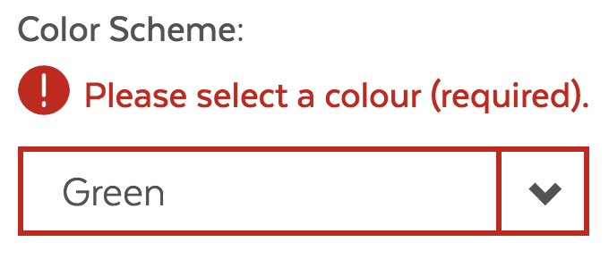
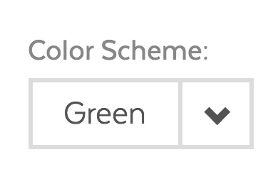
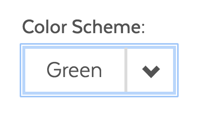
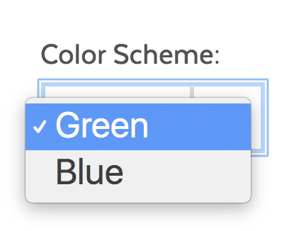

# Select Box

## Overview

Select box is a common form component used when only a single option should be selected from a list of possibilities. The select box should be used if you are constrained by space or if you have more than 3 and less than 10 selectable options. A group of radio buttons is preferred if you are able to show all available options to users. If you have a large number of selectable options, users should be able provided with typeahead functionality \(see input text typeahead\). 

#### Disclaimer

Select boxes should not be used if possible. The behavior of select boxes varies across devices and they are not intuitive to non-technical users. Better options  with comparable functionality are text inputs or a group of radio buttons.

### Select Box States

| Visual | Name | Description |
| :--- | :--- | :--- |
|   | Standard |  |
|   | Error |  |
|   | Disabled |  |
|   | Focus |  |
|   | Active |  |

### Accessibility & Best Practices

* Options should be sorted in a logical manner.
* Create simple, clear, and relevant options.
* Provide a clear label.

## Code



[SelectBox in Pattern Lab](https://mayflower.digital.mass.gov/?p=atoms-select-box)



[SelectBox in React Storybook](https://mayflower-react.digital.mass.gov/?knob-utilityNav.panel.0=%7B%22description%22%3A%7B%22text%22%3A%22The%20%3Ca%20href%3D%5C%22%23%5C%22%3EA-Z%20Organizations%20page%3C%2Fa%3E%20provides%20an%20alphabetical%20listing%20of%20government%20organizations%2C%20including%20commissions%2C%20departments%2C%20and%20bureaus.%22%7D%7D&knob-selectBox.defaultSelected=Green&knob-utilityNav.panel.1=%7B%22description%22%3A%7B%22text%22%3A%22These%20are%20the%20top%20requested%20sites%20you%20can%20log%20in%20to%20access%20state%20provided%20services%22%7D%2C%22links%22%3A%5B%7B%22text%22%3A%22Unemployment%20Online%22%2C%22href%22%3A%22https%3A%2F%2Fuionline.detma.org%2FClaimant%2FCore%2FLogin.ASPX%22%2C%22type%22%3A%22external%22%7D%2C%7B%22text%22%3A%22Virtual%20Gateway%20%28SNAP%29%22%2C%22href%22%3A%22https%3A%2F%2Fsso.hhs.state.ma.us%2Foam%2Fserver%2Fobrareq.cgi%3Fencquery%253DA2%252Fmo5AkZreDycpyP0JZAEOYGvW2hviyNhH9Sht2xPp0V1%252BBtWfHnmRGr6zNHOqOlcjphPk7p6bpHHRyNzzk9IYQ%252FcN%252B%252FIcqL2ThnI217OsIKZepptTpGBx83SI0NWjsE7vDi72caItXWlelbGQT7ePanlrVUUy2%252Fj1UEUaXi5G7m47KO9djBnoetZRCtp9G2ZTNFf6zvCGU7Cs02AXYUj2JMH4aqol%252Bh3OK6uhJNNkFvwQ1MFRUa4gR1az4iaW9u83ExKb2a9eDv8ZIUqhlq3%252BNVGTqZHAsHX4KOONSGQRBwCtLNPWwruacjdd9CaEqeIJ2tnP45KrM93edZ6zU1yoWGbAp%252BUWWMqk4HyrtuA8%253D%2520agentid%253Dwebgate1%2520ver%253D1%2520crmethod%253D2%22%2C%22type%22%3A%22external%22%7D%2C%7B%22text%22%3A%22Child%20Support%20Enforcement%22%2C%22href%22%3A%22https%3A%2F%2Fecse.cse.state.ma.us%2FECSE%2FLogin%2Flogin.asp%22%2C%22type%22%3A%22external%22%7D%5D%7D&knob-utilityNav.closeText.0=Close&knob-utilityNav.closeText.1=Close&knob-mainNav.text0=Living&knob-selectBox.options=%5B%7B%22text%22%3A%22Green%22%2C%22value%22%3A%22green%22%7D%2C%7B%22text%22%3A%22Blue%22%2C%22value%22%3A%22blue%22%7D%5D&knob-mainNav.text1=Working&knob-mainNav.href0=%23&knob-mainNav.text2=Learning&knob-mainNav.href1=%23&knob-mainNav.text3=Visiting%20%26%20Exploring&knob-mainNav.href2=%23&knob-mainNav.text4=Your%20Government&knob-mainNav.href3=%2Fpatterns%2F05-pages-section-landing%2F05-pages-section-landing.html&knob-selectBox.className=ma__select-box%20js-dropdown&knob-mainNav.href4=%23&knob-utilityNav.text.0=State%20Organizations&knob-utilityNav.text.1=Log%20in%20to...&knob-selectBox.id=color-select&knob-header.siteLogoDomain.url.domain=https%3A%2F%2Fwww.mass.gov%2F&knob-mainNav.subNav0=%5B%7B%22href%22%3A%22%23%22%2C%22text%22%3A%22Health%20%26%20Social%20Services%22%7D%2C%7B%22href%22%3A%22%23%22%2C%22text%22%3A%22Family%20%26%20Children%22%7D%2C%7B%22href%22%3A%22%23%22%2C%22text%22%3A%22Housing%22%7D%2C%7B%22href%22%3A%22%23%22%2C%22text%22%3A%22Transportation%22%7D%2C%7B%22href%22%3A%22%23%22%2C%22text%22%3A%22Legal%20%26%20Justice%22%7D%2C%7B%22href%22%3A%22%23%22%2C%22text%22%3A%22Public%20Safety%22%7D%2C%7B%22href%22%3A%22%23%22%2C%22text%22%3A%22Voting%22%7D%2C%7B%22href%22%3A%22%23%22%2C%22text%22%3A%22Taxes%22%7D%5D&knob-mainNav.active3=true&knob-mainNav.subNav1=%5B%7B%22href%22%3A%22%23%22%2C%22text%22%3A%22Unemployment%22%7D%2C%7B%22href%22%3A%22%23%22%2C%22text%22%3A%22Finding%20a%20Job%22%7D%2C%7B%22href%22%3A%22%23%22%2C%22text%22%3A%22Worker%E2%80%99s%20Rights%20%26%20Safety%22%7D%2C%7B%22href%22%3A%22%23%22%2C%22text%22%3A%22Business%20Services%20%26%20Resources%22%7D%2C%7B%22href%22%3A%22%23%22%2C%22text%22%3A%22Professional%20Licensing%20%26%20Certification%22%7D%2C%7B%22href%22%3A%22%23%22%2C%22text%22%3A%22Professional%20Training%22%7D%5D&knob-searchBannerForm.placeholder=Search%20Mass.gov&knob-mainNav.subNav2=%5B%7B%22href%22%3A%22%23%22%2C%22text%22%3A%22Early%20Childhood%20Education%22%7D%2C%7B%22href%22%3A%22%23%22%2C%22text%22%3A%22K-12%20Schools%22%7D%2C%7B%22href%22%3A%22%23%22%2C%22text%22%3A%22Higher%20Education%22%7D%2C%7B%22href%22%3A%22%23%22%2C%22text%22%3A%22Continuing%20Education%22%7D%5D&knob-selectBox.required=true&knob-mainNav.subNav3=%5B%7B%22href%22%3A%22%23%22%2C%22text%22%3A%22Recreational%20Licenses%20%26%20Permits%22%7D%2C%7B%22href%22%3A%22%2Fpatterns%2F05-pages-topic%2F05-pages-topic.html%22%2C%22text%22%3A%22State%20Parks%20%26%20Recreation%22%7D%2C%7B%22href%22%3A%22%23%22%2C%22text%22%3A%22Travel%20%26%20Tourism%22%7D%2C%7B%22href%22%3A%22%23%22%2C%22text%22%3A%22Arts%20%26%20Culture%22%7D%5D&knob-mainNav.subNav4=%5B%7B%22href%22%3A%22%23%22%2C%22text%22%3A%22Office%20of%20the%20Governor%22%7D%2C%7B%22href%22%3A%22%23%22%2C%22text%22%3A%22State%20Agencies%22%7D%2C%7B%22href%22%3A%22%2Fpatterns%2F05-pages-topic-your-government%2F05-pages-topic-your-government.html%22%2C%22text%22%3A%22Executive%20Branch%22%7D%2C%7B%22href%22%3A%22%23%22%2C%22text%22%3A%22Judicial%20Branch%22%7D%2C%7B%22href%22%3A%22%23%22%2C%22text%22%3A%22Legislative%20Branch%22%7D%2C%7B%22href%22%3A%22%23%22%2C%22text%22%3A%22Local%20Government%22%7D%5D&knob-utilityNav.ariaLabelText.0=&knob-utilityNav.ariaLabelText.1=Log%20in%20to%20the%20most%20requested%20services&knob-utilityNav.icons.0=SvgBuilding&knob-utilityNav.icons.1=SvgLogin&knob-selectBox.label=Color%20Scheme%3A&selectedKind=atoms%2Fforms&selectedStory=SelectBox&full=0&addons=1&stories=1&panelRight=0&addonPanel=storybook%2Factions%2Factions-panel)



## Style

### Classnames

| Name | Scss Modifier |
| :--- | :--- |
| Standard | .ma\_\_select-box\_\_field |
| Disabled | .ma\_\_select-box\_\_field–disabled |
| Inline | .ma\_\_select-box\_\_field–inline |
| Error | .has-error |

