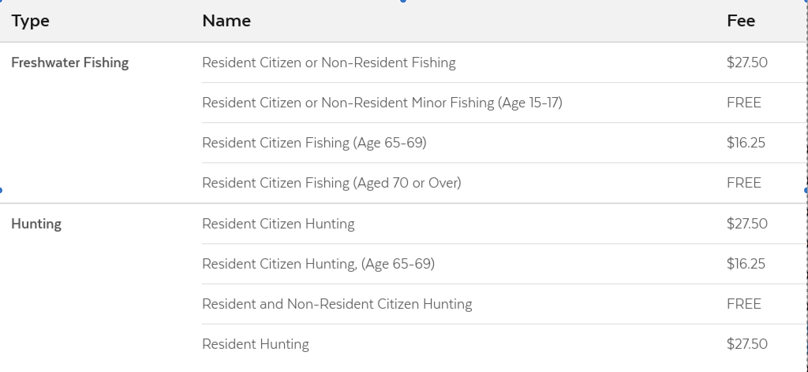

# Table

## Overview

Tables should only be used to present raw data sets, to make content easy to scan and compare. If used for non-tabular data, this will not adhere to accessibility guidelines. A good example of using a table is to display fee data. Tables outside of rich text editors are responsive, and at smaller screen sizes, the columns and rows stack, turning into a list. Rich text tables have overflow turned on and will scroll on smaller screens.



### Accessibility & Best Practices

## Code

### Table



```markup
<table class="ma__table ">
  <thead>
    <tr>
      <th scope="col">Type</th>
      <th scope="col">Name</th>
      <th scope="col">Fee</th>
    </tr>
  </thead>
  <tbody>
    <tr>
      <th data-label="Type" scope="row" rowspan="4">Freshwater Fishing</th>
      <td data-label="Name">Resident Citizen or Non-Resident Fishing</td>
      <td data-label="Fee">$27.50</td>
    </tr>
    <tr class="is-offset">
      <td data-label="Name">Resident Citizen or Non-Resident Minor Fishing (Age 15-17)</td>
      <td data-label="Fee">FREE</td>
    </tr>
    <tr class="is-offset">
      <td data-label="Name">Resident Citizen Fishing (Age 65-69)</td>
      <td data-label="Fee">$16.25</td>
    </tr>
    <tr class="is-offset">
      <td data-label="Name">Resident Citizen Fishing (Aged 70 or Over)</td>
      <td data-label="Fee">FREE</td>
    </tr>
  </tbody>
  <tbody>
    <tr>
      <th data-label="Type" scope="row" rowspan="4">Hunting</th>
      <td data-label="Name">Resident Citizen Hunting</td>
      <td data-label="Fee">$27.50</td>
    </tr>
    <tr class="is-offset">
      <td data-label="Name">Resident Citizen Hunting, (Age 65-69)</td>
      <td data-label="Fee">$16.25</td>
    </tr>
    <tr class="is-offset">
      <td data-label="Name">Resident and Non-Resident Citizen Hunting</td>
      <td data-label="Fee">FREE</td>
    </tr>
    <tr class="is-offset">
      <td data-label="Name">Resident Hunting</td>
      <td data-label="Fee">$27.50</td>
    </tr>
  </tbody>
</table>
```



[Table in Storybook](https://mayflower-react.digital.mass.gov/?knob-href=%23&knob-info=&knob-ButtonSearch.text=Search&knob-HeaderSearch.defaultText=&knob-HeaderSearch.withOrgDropdown=true&knob-ButtonSearch.ariaLabel=Search&knob-tableOptions.feeTable=%7B%22head%22%3A%7B%22rows%22%3A%5B%7B%22rowSpanOffset%22%3Afalse%2C%22cells%22%3A%5B%7B%22heading%22%3Afalse%2C%22colspan%22%3A%22%22%2C%22rowspan%22%3A%22%22%2C%22text%22%3A%22Type%22%7D%2C%7B%22heading%22%3Atrue%2C%22colspan%22%3A%22%22%2C%22rowspan%22%3A%22%22%2C%22text%22%3A%22Name%22%7D%2C%7B%22heading%22%3Atrue%2C%22colspan%22%3A%22%22%2C%22rowspan%22%3A%22%22%2C%22text%22%3A%22Fee%22%7D%5D%7D%5D%7D%2C%22bodies%22%3A%5B%7B%22rows%22%3A%5B%7B%22rowSpanOffset%22%3Afalse%2C%22cells%22%3A%5B%7B%22heading%22%3Atrue%2C%22colspan%22%3A%22%22%2C%22rowspan%22%3A%224%22%2C%22text%22%3A%22Freshwater%20Fishing%22%7D%2C%7B%22heading%22%3Afalse%2C%22colspan%22%3A%22%22%2C%22rowspan%22%3A%22%22%2C%22text%22%3A%22Resident%20Citizen%20or%20Non-Resident%20Fishing%22%7D%2C%7B%22heading%22%3Afalse%2C%22colspan%22%3A%22%22%2C%22rowspan%22%3A%22%22%2C%22text%22%3A%22%2427.50%22%7D%5D%7D%2C%7B%22rowSpanOffset%22%3Atrue%2C%22cells%22%3A%5B%7B%22heading%22%3Afalse%2C%22colspan%22%3A%22%22%2C%22rowspan%22%3A%22%22%2C%22text%22%3A%22Resident%20Citizen%20or%20Non-Resident%20Minor%20Fishing%20%28Age%2015-17%29%22%7D%2C%7B%22heading%22%3Afalse%2C%22colspan%22%3A%22%22%2C%22rowspan%22%3A%22%22%2C%22text%22%3A%22FREE%22%7D%5D%7D%2C%7B%22rowSpanOffset%22%3Atrue%2C%22cells%22%3A%5B%7B%22heading%22%3Afalse%2C%22colspan%22%3A%22%22%2C%22rowspan%22%3A%22%22%2C%22text%22%3A%22Resident%20Citizen%20Fishing%20%28Age%2065-69%29%22%7D%2C%7B%22heading%22%3Afalse%2C%22colspan%22%3A%22%22%2C%22rowspan%22%3A%22%22%2C%22text%22%3A%22%2416.25%22%7D%5D%7D%2C%7B%22rowSpanOffset%22%3Atrue%2C%22cells%22%3A%5B%7B%22heading%22%3Afalse%2C%22colspan%22%3A%22%22%2C%22rowspan%22%3A%22%22%2C%22text%22%3A%22Resident%20Citizen%20Fishing%20%28Aged%2070%20or%20Over%29%22%7D%2C%7B%22heading%22%3Afalse%2C%22colspan%22%3A%22%22%2C%22rowspan%22%3A%22%22%2C%22text%22%3A%22FREE%22%7D%5D%7D%5D%7D%2C%7B%22rows%22%3A%5B%7B%22rowSpanOffset%22%3Afalse%2C%22cells%22%3A%5B%7B%22heading%22%3Atrue%2C%22colspan%22%3A%22%22%2C%22rowspan%22%3A%224%22%2C%22text%22%3A%22Hunting%22%7D%2C%7B%22heading%22%3Afalse%2C%22colspan%22%3A%22%22%2C%22rowspan%22%3A%22%22%2C%22text%22%3A%22Resident%20Citizen%20Hunting%22%7D%2C%7B%22heading%22%3Afalse%2C%22colspan%22%3A%22%22%2C%22rowspan%22%3A%22%22%2C%22text%22%3A%22%2427.50%22%7D%5D%7D%2C%7B%22rowSpanOffset%22%3Atrue%2C%22cells%22%3A%5B%7B%22heading%22%3Afalse%2C%22colspan%22%3A%22%22%2C%22rowspan%22%3A%22%22%2C%22text%22%3A%22Resident%20Citizen%20Hunting%2C%20%28Age%2065-69%29%22%7D%2C%7B%22heading%22%3Afalse%2C%22colspan%22%3A%22%22%2C%22rowspan%22%3A%22%22%2C%22text%22%3A%22%2416.25%22%7D%5D%7D%2C%7B%22rowSpanOffset%22%3Atrue%2C%22cells%22%3A%5B%7B%22heading%22%3Afalse%2C%22colspan%22%3A%22%22%2C%22rowspan%22%3A%22%22%2C%22text%22%3A%22Resident%20and%20Non-Resident%20Citizen%20Hunting%22%7D%2C%7B%22heading%22%3Afalse%2C%22colspan%22%3A%22%22%2C%22rowspan%22%3A%22%22%2C%22text%22%3A%22FREE%22%7D%5D%7D%2C%7B%22rowSpanOffset%22%3Atrue%2C%22cells%22%3A%5B%7B%22heading%22%3Afalse%2C%22colspan%22%3A%22%22%2C%22rowspan%22%3A%22%22%2C%22text%22%3A%22Resident%20Hunting%22%7D%2C%7B%22heading%22%3Afalse%2C%22colspan%22%3A%22%22%2C%22rowspan%22%3A%22%22%2C%22text%22%3A%22%2427.50%22%7D%5D%7D%5D%7D%5D%7D&knob-button.href=https%3A%2F%2Fmass.gov&knob-HeaderSearch.placeholder=Search%20Mass.gov&knob-button.text=button&knob-button.info=this%20will%20be%20the%20tooltip%20text%20on%20hover&knob-ButtonWithIcon.text=BUTTON&knob-HeaderSearch.buttonSearch.ariaLabel=Search&knob-HeaderSearch.orgDropdown.inputText=%7B%22boxed%22%3Atrue%2C%22label%22%3Anull%2C%22placeholder%22%3A%22Search%20an%20organization...%22%2C%22id%22%3A%22org-typeahead%22%2C%22options%22%3A%5B%7B%22text%22%3A%22%22%2C%22value%22%3A%22%22%7D%2C%7B%22text%22%3A%22Org%20Having%20%28Parentheses%20in%20the%20Name%29%22%2C%22value%22%3A%22org-having-parentheses-in-the-name%22%7D%2C%7B%22text%22%3A%22Attorney%20General%27s%20Office%22%2C%22value%22%3A%22attorney-general-office%22%7D%2C%7B%22text%22%3A%22Governor%27s%20Office%22%2C%22value%22%3A%22governors-office%22%7D%2C%7B%22text%22%3A%22Bureau%20of%20Environmental%20Health%22%2C%22value%22%3A%22bureau-of-environmental-health%22%7D%2C%7B%22text%22%3A%22Department%20of%20Conservation%20%26%20Recreation%22%2C%22value%22%3A%22department-of-conservation--recreation%22%7D%2C%7B%22text%22%3A%22Department%20of%20Unemployment%20Assistance%22%2C%22value%22%3A%22department-of-unemployment-assistance%22%7D%2C%7B%22text%22%3A%22495%2FMetroWest%20Suburban%20Edge%20Community%20Commission%22%2C%22value%22%3A%22495metrowest-suburban-edge-community-commission%22%7D%2C%7B%22text%22%3A%22Administrative%20Council%20on%20Toxics%20Use%20Reduction%22%2C%22value%22%3A%22administrative-council-on-toxics-use-reduction%22%7D%2C%7B%22text%22%3A%22Advisory%20Committee%20to%20the%20Administrative%20Council%20on%20Toxics%20Use%20Reduction%22%2C%22value%22%3A%22advisory-committee-to-the-administrative-council-on-toxics-use-reduction%22%7D%2C%7B%22text%22%3A%22Alcoholic%20Beverages%20Control%20Commission%22%2C%22value%22%3A%22alcoholic-beverages-control-commission%22%7D%2C%7B%22text%22%3A%22Appeals%20Court%22%2C%22value%22%3A%22appeals-court%22%7D%2C%7B%22text%22%3A%22Architectural%20Access%20Board%22%2C%22value%22%3A%22architectural-access-board%22%7D%2C%7B%22text%22%3A%22Berkshire%20District%20Attorney%20Paul%20J.%20Caccaviello%22%2C%22value%22%3A%22berkshire-district-attorney-paul-j-caccaviello%22%7D%2C%7B%22text%22%3A%22Board%20of%20Registration%20in%20Dentistry%22%2C%22value%22%3A%22board-of-registration-in-dentistry%22%7D%2C%7B%22text%22%3A%22Board%20of%20Registration%20in%20Medicine%22%2C%22value%22%3A%22board-of-registration-in-medicine%22%7D%5D%2C%22selected%22%3A%22%22%7D&knob-button.outline=true&knob-HeaderSearch.orgDropdown.dropdownButton=%7B%22text%22%3A%22All%20Organizations%22%2C%22capitalized%22%3Atrue%7D&knob-linkText=Lorem%20ipsum%20dolor%20sit%20amet&knob-HeaderSearch.buttonSearch.text=Search&knob-ButtonWithIcon.icon=chevron&selectedKind=atoms%2Ftable&selectedStory=Table&full=0&addons=1&stories=1&panelRight=0&addonPanel=storybooks%2Fstorybook-addon-knobs)



[Table in Pattern Lab](https://mayflower.digital.mass.gov/?p=atoms-table)



## Style

### Classnames

| **Name** | **scss Modifier** |
| --- | --- | --- |
| Table | .ma\_\_table |
| Table Row | .is-offset |

