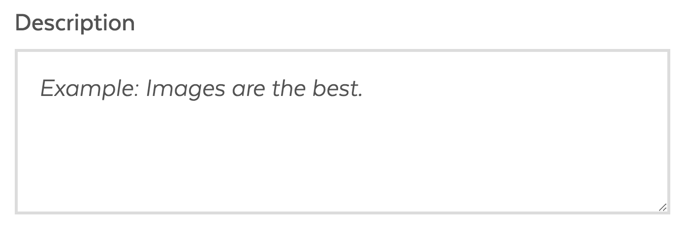
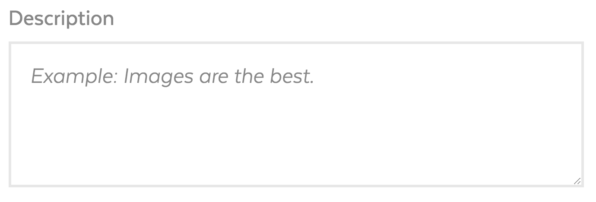
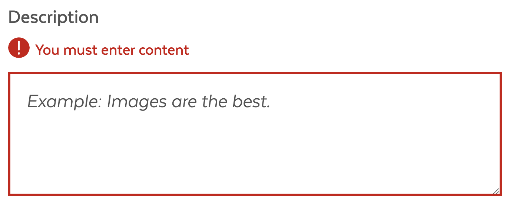
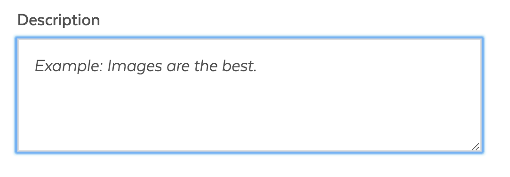

# Text Area

## Overview

Text input fields enable users to enter long and free form content. TextArea should be used when it is required or expected that the user enters one or more sentences. Text area fields have resizing controls that let the user reduce or expand the size of the input.

### Text Area States

| Visual | Name | Description |
| :--- | :--- | :--- |
|  |  Standard |  |
|  |  Disabled |  |
|  |  Error |  |
|  |  Focus |  |

### Accessibility & Best Practices

* **Label** \(_labelText_\): The label should appropriately indicate to the user what they should enter in the text area. Use sentence style capitalization.
* **Placeholder** \(_placeholder_\): The placeholder text should provide hints to users on what to enter in the input. Use placeholder only when further clarification is needed.
* **Error Message** \(_errorMsg_\): Error messages should indicate to users what the field issue is and how they can resolve it. Inform the user what is wrong and how to fix it. Error messages should only be shown to a user after they have interacted with the field

## Code

## Style

