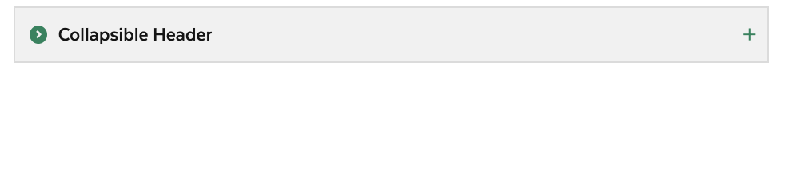
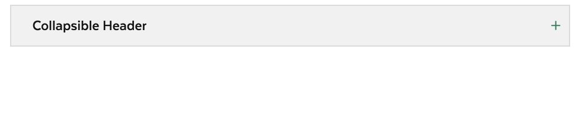

# Accordion Item

## Overview

Accordions aid in providing only needed and key content to users. The are created as clickable headers that can collapse or expand to show additional content. Accordions should be used when users only need to consume or interact with specific pieces of content at a given time or if page space is limited.

### Accordion Item Variations

| Visual | Name | Description |
| :--- | :--- | :--- |
|  | Default | This is the default accordion style, a colored heading with bordered content. |
|  | Borderless | A borderless accordion content style. |
|  | Subtle | An accordion whose header turns transparent  in an open state. |
|  | No Icon | An accordion whose header does not include an icon. |
|  | Secondary | An accordion that is a less prominent element on the page. |

### Accessibility & Best Practices


#### Toggle button

Accordions have a toggle feature to show/hide their contents. Use `<button>` tag for a toggle, then assistive technologies know this is an interacitve element.

Make sure their state is clear to assisitive technologies when it gets focused, then users could determine their next action.

##### Association with toggled content block

The button and its associated content block need to be paired.  The content block has a unique `id` in the page. The toggle button has `aria-controls` with the same value as the `id`'s.

##### Status

The status can be addressed with the `aria-expanded` attribute.  Set its value to `true` for show and `false` for hide.  

The status should get updated accordingly with the user's action.

##### Focus and its order
While the user interacts with the toggle button, the focus should stay on the button.

Once the user tabs to the next element, the focus moves from the button to the next element. When the toggle state is **show**, the next focus should be on an element in the content block displayed by the toggle. 

#### aria-label

This is an optional. Omit it unless you need it.

NOTE:  not sure about use of this.  It doesn't seem to be necessary.

#### Arrow icon

The green circle arrow icon is a decorative element. It's set to invisible to assisitive technologies to disable interactions with `aria-hidden="true"`.

#### Content block

The content block also addresses its status with `aria-hidden` to assisitive technologies.  The status is correspoinging to its associated toggle button.

| Status | Toggle button | Content block |
| :--- | :--- | :--- |
| Show | aria-expanded="true"  | aria-hidden="false" |
| Hide | aria-expanded="false" | aria-hidden="true"  |

The status is managed by JavaScript. To ensure the content in the block is accessible in case the JavaScript doesn't load or is disabled, the markup should has `aria-hidden="false"` and the JavaScript overrides it based on the actual status at the moment.


## Code



```markup
<div class="ma__accordion-item">
  <header class="ma__accordion-header">
    <button class="ma__accordion-header__button ma__accordion-header__button--solid" aria-label="Collapsible Header" aria-expanded="false">
      <div class="ma__accordion-header__icon">
        <svg xmlns="http://www.w3.org/2000/svg" width="35" height="35" viewBox="0 0 35 35">
          <path class="st0" d="M17.5,35C7.8,35,0,27.2,0,17.5C0,7.8,7.8,0,17.5,0C27.2,0,35,7.8,35,17.5C35,27.2,27.2,35,17.5,35z M16,9 l-3,2.9l5.1,5.1L13,22.1l3,2.9l8-8L16,9z"></path>
        </svg>
      </div>
      <h2 class="ma__accordion-header__title">Collapsible Header</h2>
    </button>
  </header>
  <div class="ma__accordion-content__body collapsed" style="height: 0px;">
    <p>Most parks and beaches that charge daily parking fees sell MassParks Passes at their contact stations during their paid parking seasons. Just ask to purchase a MassParks Pass and show your driver’s license or proof of residency. Please note: most parks cannot accept credit cards, so you’ll have to pay with cash or a check</p>
  </div>
</div>
```



[Accordion Item in Storybook](https://mayflower-react.digital.mass.gov/?knob-href=%23&knob-accordion.emphasize=true&knob-info=&knob-selectBox.defaultSelected=Green&knob-selectBox.options=%5B%7B%22text%22%3A%22Green%22%2C%22value%22%3A%22green%22%7D%2C%7B%22text%22%3A%22Blue%22%2C%22value%22%3A%22blue%22%7D%5D&knob-accordion.border=true&knob-accordion.info=Collapsible%20Header&knob-children.paragraph.text%20%28example%29=Most%20parks%20and%20beaches%20that%20charge%20daily%20parking%20fees%20sell%20MassParks%20Passes%20at%20their%20contact%20stations%20during%20their%20paid%20parking%20seasons.%20Just%20ask%20to%20purchase%20a%20MassParks%20Pass%20and%20show%20your%20driver%E2%80%99s%20license%20or%20proof%20of%20residency.%20Please%20note%3A%20most%20parks%20cannot%20accept%20credit%20cards%2C%20so%20you%E2%80%99ll%20have%20to%20pay%20with%20cash%20or%20a%20check&knob-selectBox.className=ma__select-box%20js-dropdown&knob-List%20Item%200=This%20is%20a%20list%20item%20in%20an%20unordered%20list&knob-tableOptions.feeTable=%7B%22head%22%3A%7B%22rows%22%3A%5B%7B%22rowSpanOffset%22%3Afalse%2C%22cells%22%3A%5B%7B%22heading%22%3Afalse%2C%22colspan%22%3A%22%22%2C%22rowspan%22%3A%22%22%2C%22text%22%3A%22Type%22%7D%2C%7B%22heading%22%3Atrue%2C%22colspan%22%3A%22%22%2C%22rowspan%22%3A%22%22%2C%22text%22%3A%22Name%22%7D%2C%7B%22heading%22%3Atrue%2C%22colspan%22%3A%22%22%2C%22rowspan%22%3A%22%22%2C%22text%22%3A%22Fee%22%7D%5D%7D%5D%7D%2C%22bodies%22%3A%5B%7B%22rows%22%3A%5B%7B%22rowSpanOffset%22%3Afalse%2C%22cells%22%3A%5B%7B%22heading%22%3Atrue%2C%22colspan%22%3A%22%22%2C%22rowspan%22%3A%224%22%2C%22text%22%3A%22Freshwater%20Fishing%22%7D%2C%7B%22heading%22%3Afalse%2C%22colspan%22%3A%22%22%2C%22rowspan%22%3A%22%22%2C%22text%22%3A%22Resident%20Citizen%20or%20Non-Resident%20Fishing%22%7D%2C%7B%22heading%22%3Afalse%2C%22colspan%22%3A%22%22%2C%22rowspan%22%3A%22%22%2C%22text%22%3A%22%2427.50%22%7D%5D%7D%2C%7B%22rowSpanOffset%22%3Atrue%2C%22cells%22%3A%5B%7B%22heading%22%3Afalse%2C%22colspan%22%3A%22%22%2C%22rowspan%22%3A%22%22%2C%22text%22%3A%22Resident%20Citizen%20or%20Non-Resident%20Minor%20Fishing%20%28Age%2015-17%29%22%7D%2C%7B%22heading%22%3Afalse%2C%22colspan%22%3A%22%22%2C%22rowspan%22%3A%22%22%2C%22text%22%3A%22FREE%22%7D%5D%7D%2C%7B%22rowSpanOffset%22%3Atrue%2C%22cells%22%3A%5B%7B%22heading%22%3Afalse%2C%22colspan%22%3A%22%22%2C%22rowspan%22%3A%22%22%2C%22text%22%3A%22Resident%20Citizen%20Fishing%20%28Age%2065-69%29%22%7D%2C%7B%22heading%22%3Afalse%2C%22colspan%22%3A%22%22%2C%22rowspan%22%3A%22%22%2C%22text%22%3A%22%2416.25%22%7D%5D%7D%2C%7B%22rowSpanOffset%22%3Atrue%2C%22cells%22%3A%5B%7B%22heading%22%3Afalse%2C%22colspan%22%3A%22%22%2C%22rowspan%22%3A%22%22%2C%22text%22%3A%22Resident%20Citizen%20Fishing%20%28Aged%2070%20or%20Over%29%22%7D%2C%7B%22heading%22%3Afalse%2C%22colspan%22%3A%22%22%2C%22rowspan%22%3A%22%22%2C%22text%22%3A%22FREE%22%7D%5D%7D%5D%7D%2C%7B%22rows%22%3A%5B%7B%22rowSpanOffset%22%3Afalse%2C%22cells%22%3A%5B%7B%22heading%22%3Atrue%2C%22colspan%22%3A%22%22%2C%22rowspan%22%3A%224%22%2C%22text%22%3A%22Hunting%22%7D%2C%7B%22heading%22%3Afalse%2C%22colspan%22%3A%22%22%2C%22rowspan%22%3A%22%22%2C%22text%22%3A%22Resident%20Citizen%20Hunting%22%7D%2C%7B%22heading%22%3Afalse%2C%22colspan%22%3A%22%22%2C%22rowspan%22%3A%22%22%2C%22text%22%3A%22%2427.50%22%7D%5D%7D%2C%7B%22rowSpanOffset%22%3Atrue%2C%22cells%22%3A%5B%7B%22heading%22%3Afalse%2C%22colspan%22%3A%22%22%2C%22rowspan%22%3A%22%22%2C%22text%22%3A%22Resident%20Citizen%20Hunting%2C%20%28Age%2065-69%29%22%7D%2C%7B%22heading%22%3Afalse%2C%22colspan%22%3A%22%22%2C%22rowspan%22%3A%22%22%2C%22text%22%3A%22%2416.25%22%7D%5D%7D%2C%7B%22rowSpanOffset%22%3Atrue%2C%22cells%22%3A%5B%7B%22heading%22%3Afalse%2C%22colspan%22%3A%22%22%2C%22rowspan%22%3A%22%22%2C%22text%22%3A%22Resident%20and%20Non-Resident%20Citizen%20Hunting%22%7D%2C%7B%22heading%22%3Afalse%2C%22colspan%22%3A%22%22%2C%22rowspan%22%3A%22%22%2C%22text%22%3A%22FREE%22%7D%5D%7D%2C%7B%22rowSpanOffset%22%3Atrue%2C%22cells%22%3A%5B%7B%22heading%22%3Afalse%2C%22colspan%22%3A%22%22%2C%22rowspan%22%3A%22%22%2C%22text%22%3A%22Resident%20Hunting%22%7D%2C%7B%22heading%22%3Afalse%2C%22colspan%22%3A%22%22%2C%22rowspan%22%3A%22%22%2C%22text%22%3A%22%2427.50%22%7D%5D%7D%5D%7D%5D%7D&knob-List%20Item%201=An%20unordered%20list%20is%20a%20list%20in%20which%20the%20sequence%20of%20items%20is%20not%20important.%20Sometimes%2C%20an%20unordered%20list%20is%20a%20bulleted%20list.%20And%20this%20is%20a%20long%20list%20item%20in%20an%20unordered%20list%20that%20can%20wrap%20onto%20a%20new%20line.&knob-List%20Item%202=Lists%20can%20be%20nested%20inside%20of%20each%20other&knob-selectBox.id=color-select&knob-List%20Item%203=This%20is%20the%20last%20list%20item&knob-selectBox.required=true&knob-accordion.icon=circlechevron&knob-Sub%20Item%200=This%20is%20a%20nested%20list%20item&knob-accordion.headerLevel=2&knob-Sub%20Item%201=This%20is%20another%20nested%20list%20item%20in%20an%20unordered%20list&knob-accordion.title=Collapsible%20Header&knob-linkText=Lorem%20ipsum%20dolor%20sit%20amet&knob-selectBox.label=Color%20Scheme%3A&selectedKind=molecules&selectedStory=AccordionItem&full=0&addons=1&stories=1&panelRight=0&addonPanel=storybooks%2Fstorybook-addon-knobs)



Currently Not Available



## Style

### Classnames

<table>
  <thead>
    <tr>
      <th style="text-align:left">Name</th>
      <th style="text-align:left">Class Modifier</th>
    </tr>
  </thead>
  <tbody>
    <tr>
      <td style="text-align:left">Default Accordion Item</td>
      <td style="text-align:left"><code>.ma__accordion-item</code>
      </td>
    </tr>
    <tr>
      <td style="text-align:left">Borderless Accordion Item</td>
      <td style="text-align:left"><code>.ma__accordion-item--borderless</code>
      </td>
    </tr>
    <tr>
      <td style="text-align:left">
        <p>Subtle Accordion Item</p>
        <p>(modifier on accordion header element)</p>
      </td>
      <td style="text-align:left"><code>.ma__accordion-header__button--trans</code> 
      </td>
    </tr>
    <tr>
      <td style="text-align:left">Secondary Accordion Item</td>
      <td style="text-align:left"><code>.ma__accordion-item--secondary</code>
      </td>
    </tr>
  </tbody>
</table>

